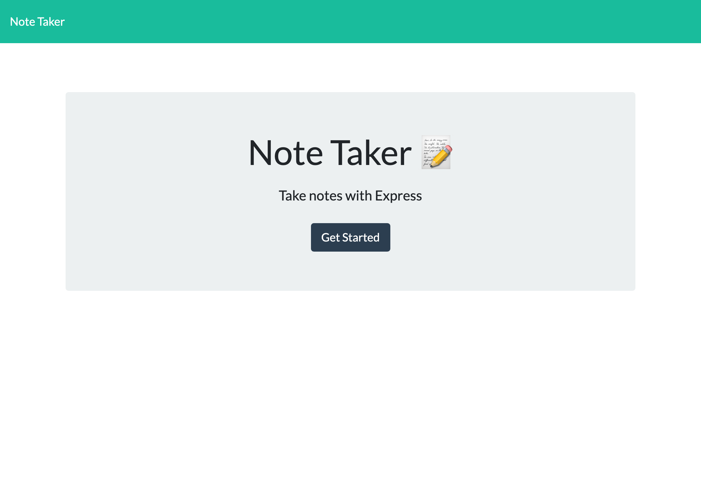
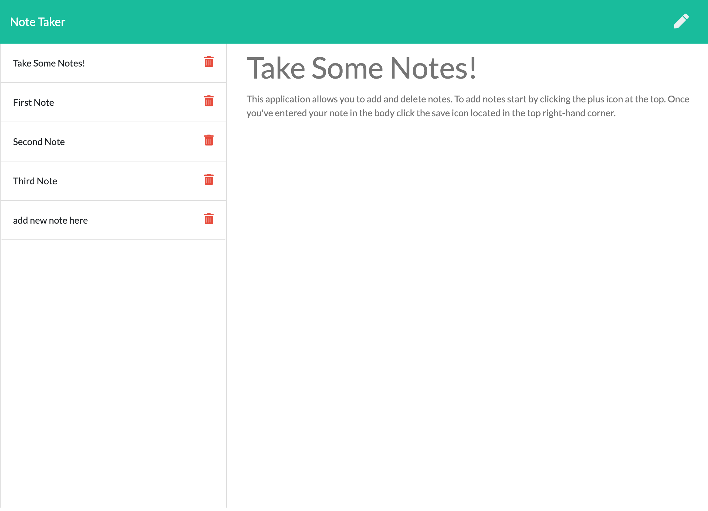
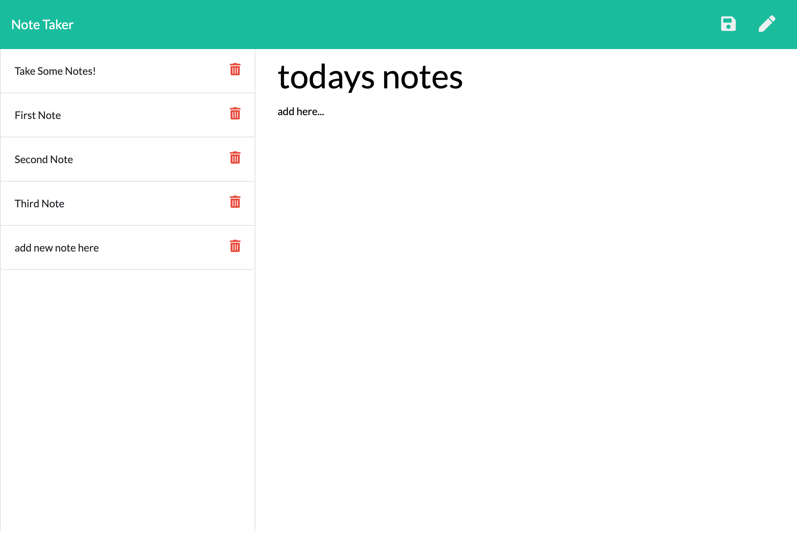
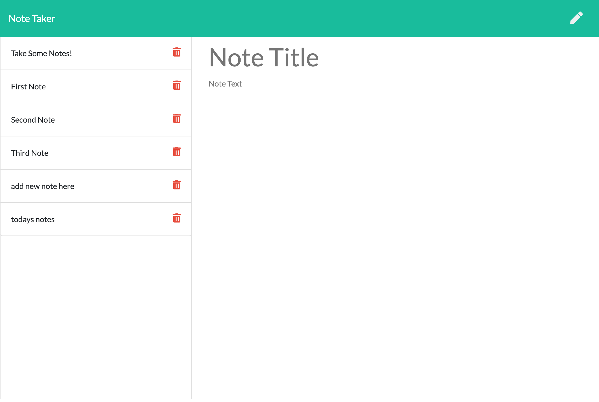

# Note Taker

 Note Taker is an app that can be used to write and save notes. This application will use an Express.js back end and will save and retrieve note data from a JSON file.


## User Story

```
AS A small business owner
I WANT to be able to write and save notes
SO THAT I can organize my thoughts and keep track of tasks I need to complete
```


## Demo

The following images show the web application's appearance and functionality: 

<br>
<br>
<br>
<br>


## Links

[The URL of the functional, deployed application.](https://noori36.github.io/WorkDayScheduler/)

[The URL of the GitHub repository.](https://github.com/noori36/Note-Taker)

- - -

[MIT](https://choosealicense.com/licenses/mit/)
